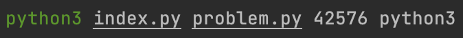
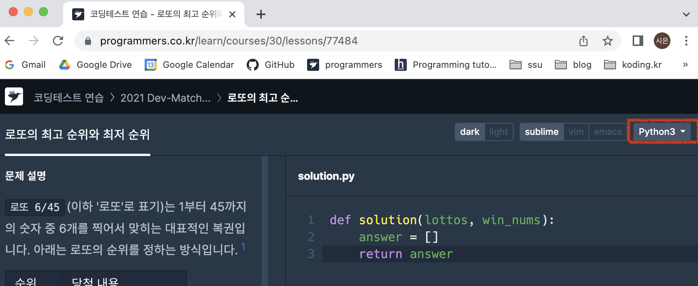

# Programmers-auto-submit 💬 

## **프로젝트 설명**
로컬 환경에서 해결한 <a href="https://programmers.co.kr/learn/challenges">프로그래머스 코딩테스트 연습 문제</a>를, CLI를 통해 제출하고 결과를 알 수 있도록 작성한 **프로그래머스 제출 자동화 스크립트**

<br/>

## **사용 방법**
### **1️⃣ &nbsp; Clone this Repository**
```bash
git clone https://github.com/sieukim/programmers-auto-submit
```

<br/>

### **2️⃣ &nbsp; Set ID and Password**
```bash
# .env 
GITHUB=깃허브 로그인 여부 (True or False)
ID=아이디 
PASSWORD=비밀번호 
```
`.env` 파일을 찾아 로그인 정보를 설정해주세요. 
- Github 계정은 `GITHUB`를 `True`로 설정하고, `ID`와 `PASSWORD`는 Github 아이디와 비밀번호로 설정해주세요.
- 이메일 계정은 `GITHUB`를 `False`로 설정하고, `ID`와 `PASSWORD`는 이메일 아이디와 비밀번호로 설정해주세요.

### **3️⃣ &nbsp; Install Libraries**
터미널에 `pip install -r requirements.txt`를 입력하여 필요 라이브러리를 설치해주세요.

### **4️⃣ &nbsp; Execute Program**
<br/>

터미널에 `python3 index.py {문제 풀이 파일 경로} {문제 번호} {풀이 언어}`를 입력하여 스크립트를 실행합니다.
- 문제 번호
  - 프로그래머스 연습 문제 주소는 `school.programmers.co.kr/learn/course/30/lessons/{문제 번호}`형식을 가집니다. 따라서 해당 **문제 번호를 주소에서 찾아 입력**해주세요. 
- 풀이 언어
    <br/>
  &nbsp;&nbsp;&nbsp;&nbsp;&nbsp;&nbsp;&nbsp;
  - 프로그래머스 연습 문제 사이트는 위와 같이 구성되어있고, 빨간색으로 표시한 위치에 풀이 언어가 있습니다. 해당 언어를 **그대로 풀이 언어에 입력**해주세요. (단, 대소문자 변경 가능, 한글 번역 불가, 띄어쓰기 불가) 

<br/>

## **데모 영상**


<br/>

## **주의 사항**
1. 스크립트 파일 실행 후 생성되는 {숫자}/chromedriver는 실행에 필요한 파일이니 삭제하지 말아주세요.
2. 크롤링 대기 시간으로 인해 30초 내외 실행 시간이 소요됩니다. 😿
3. .env 파일 안에는 개인 정보를 저장하니 개인 저장소 외 다른 곳에 올리지 않도록 주의해주세요.

<br/>

## **사용 기술**
`Python 3.9` - 스크립트 작성

`Selenium` `Webdriver` - 동적 크롤링 및 자동화 